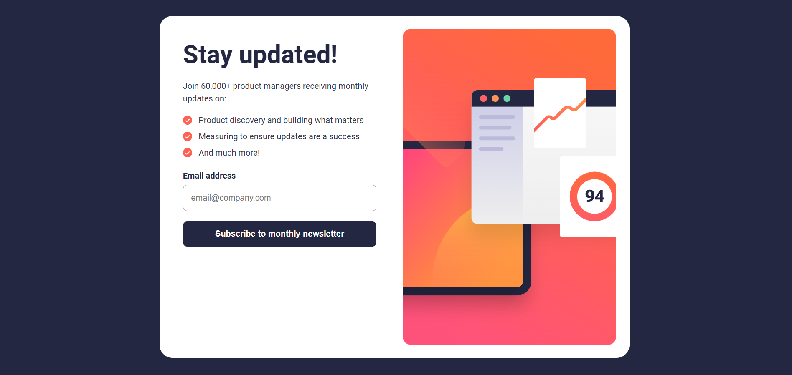

# Frontend Mentor - Newsletter Sign-Up Form With Success Message Solution

This is my solution to the Frontend Mentor Newsletter Sign-Up Form With Success Message challenge. The project was built using HTML, CSS, and JavaScript and demonstrates form validation, responsive design, and DOM manipulation.

## Overview

### The Challenge

Users should be able to:

* Add their email and submit the form
* See a success message with their email after successfully submitting the form
* See form validation messages if:

  * The field is left empty
  * The email address is not formatted correctly
* View the optimal layout for the interface depending on their device's screen size
* See hover states for interactive elements

### Screenshot

#### Sign Up Form

#### Success Message

### Links

* Solution URL: https://github.com/Sharon-Mashai/newsletter-sign-up-with-success-message.git
* Live Site URL: https://newsletter-sign-up-with-success-mes-wheat.vercel.app/

## My Process

### Built With

* HTML
* CSS
* JavaScript
* Flexbox
* Responsive Design

### What I Learned

While working on this project, I learned how to:

* Validate user input using JavaScript
* Use regular expressions to check email formats
* Handle button click events using event listeners
* Manipulate the DOM to show and hide content
* Create responsive layouts using Flexbox
* Improve user experience with validation messages

Example of the email validation used:

### Continued Development

In future projects, I would like to improve my skills in:

* Responsive web design
* Advanced JavaScript
* CSS animations and transitions
* Accessibility best practices

### Useful Resources

* Frontend Mentor
* W3Schools

## Author

**Sharon Mashai**

* GitHub: https://github.com/Sharon-Mashai

## Acknowledgments

Thanks to Frontend Mentor for providing realistic projects that help developers practice and improve their front-end development skills.
